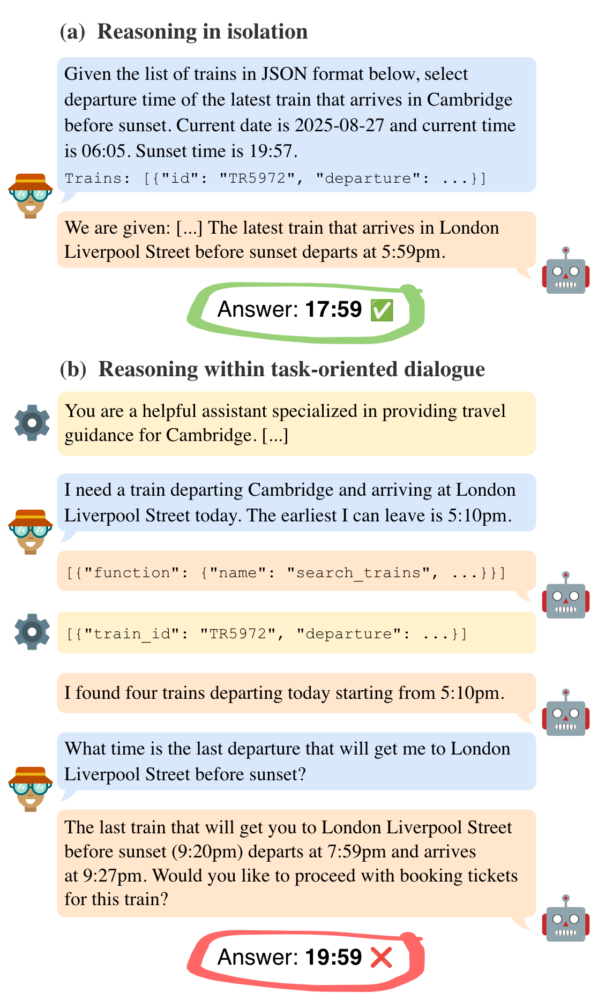

# Reasoning Gets Harder for LLMs Inside A Dialogue

Code and resources for the paper [Reasoning Gets Harder for LLMs Inside A Dialogue](https://arxiv.org/pdf/2603.20133).

We introduce **BOULDER**, a dynamic benchmark to investigate how framing reasoning tasks in a task-oriented dialogue setting affects LLM performance. The benchmark covers eight travel-related tasks that require arithmetic, spatial, and temporal reasoning with both commonsense and formal aspects. Each problem is presented in both isolated and dialogue-based variants, which enables controlled comparison.

<div align="center">
  
</div>

# BOULDER

The benchmark is based on the [MultiWoZ](https://github.com/budzianowski/multiwoz) database consisting of trains, hotels, restaurants, and attractions domains. Each task is generated procedurally with randomized parameters, making the benchmark dynamic and reproducible. Model responses are parsed by a separate LLM-based parser, with optional PPI bias correction to account for parser measurement errors.

## Setup

Create a virtual environment and install dependencies:

```bash
python3.11 -m venv venv
source venv/bin/activate
pip install -r requirements.txt
```

An [Ollama](https://ollama.com/) instance is used for inference and response parsing. Alternatively, [OpenRouter](https://openrouter.ai/) can be used as the API backend (set the `OPENROUTER_API_KEY` environment variable).

## Project Structure

```
boulder/
├── boulder/                  # Main package
│   ├── domains/              # Database models and tool definitions
│   ├── evaluation/           # Evaluation pipeline, metrics, and PPI bias correction
│   ├── llm/                  # LLM clients (Ollama, OpenRouter) and tool call handling
│   ├── prompt_templates/     # Prompt templates for dialogues and answer parsing
│   ├── benchmark_synthesizer.py
│   ├── inference.py
│   └── response_parser.py
├── configs/                  # YAML config files for inference and evaluation
├── data/
│   ├── db/                   # Domain data
│   ├── benchmark/            # Generated benchmark data
│   ├── dialogue_templates.json
│   └── parser_validation.csv # Parser annotations for PPI bias correction
├── scripts/                  # CLI entry points
└── requirements.txt
```

## Usage

### 1. Generate Benchmark

Creates benchmark datasets from dialogue templates and entity databases.

```bash
python scripts/generate_benchmark.py \
    -t data/dialogue_templates.json \
    -o data/benchmark/ \
    -n 100 \
    --seed 42
```

Use `--tasks` to generate only specific tasks (e.g. `--tasks train_ticket_price accommodation_price`).

### 2. Run Inference

Runs models on the benchmark and parses their responses. Can be configured via a YAML file or CLI arguments.

```bash
python scripts/run_inference.py configs/example_inference.yaml
```

Results are written as JSONL files to the configured `output_dir`.

### 3. Run Evaluation

Evaluates inference results. MAE-based metrics are normalized to [0, 1] via `1 / (1 + MAE/k)`. Can be configured via a YAML file or CLI arguments.

```bash
python scripts/run_evaluation.py configs/example_eval.yaml
```

Results are written to a CSV file.

### 4. Significance Testing

Compares two setups pairwise (per task and model) using a z-test on confidence intervals.

```bash
python scripts/run_significance_test.py \
    --csv data/evaluations/results.csv \
    --setups baseline dialogue
```

## Configuration

All scripts can be configured via YAML config files, CLI arguments, or a combination of both. CLI arguments override config values.

```bash
python scripts/run_inference.py --models mistral-small:24b --dataset data/benchmark/train_ticket_price.json \
    --setup-ids baseline dialogue --output-dir results/
```

See `configs/example_inference.yaml` (inference) and `configs/example_eval.yaml` (evaluation) for annotated examples of all available options.

# Citation

```
@misc{kartáč2026reasoninggetsharderllms,
      title={Reasoning Gets Harder for LLMs Inside A Dialogue}, 
      author={Ivan Kartáč and Mateusz Lango and Ondřej Dušek},
      year={2026},
      eprint={2603.20133},
      archivePrefix={arXiv},
      primaryClass={cs.CL},
      url={https://arxiv.org/abs/2603.20133}, 
}
```